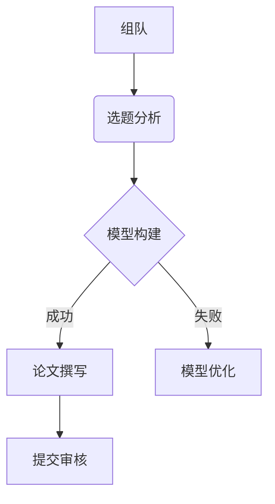

# 中南民族大学数学建模协会
> 官方代码仓库 | 2004年创立 | 国家级竞赛获奖团队

## 📌 协会简介

中南民族大学数学建模协会成立于2004年，是学术科技类校级社团。协会致力于：
- 培养数学建模思维与实战能力
- 组织参加国内外数学建模竞赛（国赛/美赛/华中杯等）
- 提供软件培训、论文写作指导、赛题解析等资源

🏆 **2023-2024荣誉**：
- 美国大学生数学建模竞赛H奖4项
- 全国大学生数学建模竞赛省级一等奖
- 全国统计建模大赛省级一等奖3项

## 🛠️ 资源目录
```

```


## 🚀 快速开始

以下是数学建模必备软件清单，按功能分类整理，包含学习资源和使用建议：

---

### 📊 数学建模核心工具包

**1. 编程与数值计算**
| 软件名称 | 用途 | 学习资源 | 备注 |
|----------|------|----------|------|
| MATLAB | 矩阵运算/算法开发/仿真 | [官方教程](https://ww2.mathworks.cn/help/matlab/) | 适合数值计算，工具箱丰富 |
| Python (NumPy/SciPy) | 科学计算/数据处理 | [SciPy教程](https://docs.scipy.org/doc/scipy/tutorial/) | 必装库：`numpy, scipy, pandas` |
| R语言 | 统计分析/数据可视化 | [R入门](https://cran.r-project.org/doc/manuals/r-release/R-intro.pdf) | 适合统计建模 |

**2. 符号计算**
| 软件名称 | 用途 | 学习资源 | 备注 |
|----------|------|----------|------|
| Mathematica | 符号推导/解析解计算 | [Wolfram演示项目](https://demonstrations.wolfram.com/) | 适合理论推导 |
| SymPy (Python库) | 符号数学计算 | [SymPy文档](https://docs.sympy.org/latest/tutorials/) | 免费替代Mathematica |

---

**📝 论文写作与排版**
| 软件名称 | 用途 | 学习资源 | 备注 |
|----------|------|----------|------|
| LaTeX (TeX Live/MikTeX) | 学术论文排版 | [Overleaf模板](https://www.overleaf.com/latex/templates/) | 必装宏包：`amsmath, graphicx` |
| MathType | 公式编辑器 | [Word公式教程](https://www.dessci.com/en/products/mathtype/) | 兼容LaTeX代码 |
| Typora (Markdown) | 快速记录思路 | [Markdown语法](https://www.markdownguide.org/) | 支持LaTeX公式 |

---

**📈 数据可视化**
| 软件名称 | 用途 | 学习资源 | 备注 |
|----------|------|----------|------|
| Matplotlib/Seaborn (Python) | 二维图表绘制 | [Gallery示例](https://matplotlib.org/stable/gallery/) | 科研级图表 |
| OriginLab | 实验数据绘图 | [官方教程](https://www.originlab.com/doc/Tutorials) | 适合出版级图像 |
| Plotly | 交互式可视化 | [Dash应用示例](https://dash.gallery/Portal/) | 适合网页嵌入 |

---

**🔍 数据与优化**
| 软件名称 | 用途 | 学习资源 | 备注 |
|----------|------|----------|------|
| SPSS/SPSSPRO | 统计分析 | [SPSS入门](https://www.ibm.com/training/spss) | 适合问卷数据分析 |
| LINGO | 优化问题求解 | [LINGO手册](https://www.lindo.com/downloads/LINGO_User_Manual.pdf) | 线性/非线性规划 |
| Gurobi | 大规模优化 | [Gurobi案例库](https://www.gurobi.com/resource/) | 学术免费许可证 |

---

**🛠️ 辅助工具**
| 软件名称 | 用途 | 学习资源 | 备注 |
|----------|------|----------|------|
| Git/GitHub | 代码版本管理 | [Git教程](https://git-scm.com/book/zh/v2) | 团队协作必备 |
| Visio | 流程图/模型图 | [微软模板](https://templates.office.com/zh-cn/flowchart) | 系统架构设计 |
| AxGlyph | 矢量绘图 | [官方示例](http://www.amyxun.com/) | 替代Visio的轻量工具 |

---

**🚀 快速上手建议**
1. 基础组合：Python (NumPy+Matplotlib) + LaTeX + Git  
2. 进阶路线：MATLAB (仿真) + R (统计) + Gurobi (优化)  
3. 替代方案：  
   • 免费替代MATLAB → [Octave](https://octave.org/)  

   • 免费替代SPSS → [JASP](https://jasp-stats.org/)  


---

**📌 注意事项**
1. 软件协作：Python可与MATLAB混合编程（通过`matlab.engine`库）  
2. 云平台：  
   • 数据挖掘：Kaggle Kernel / Google Colab  

   • 公式编辑：Mathpix Snapp（图片转LaTeX）  

3. 学术授权：多数软件提供学生免费版（如MATLAB、Gurobi）  

如果需要具体软件的安装配置指南或竞赛代码模板，可关联本仓库的`Tutorials/`目录。

### 竞赛准备流程


## 👥 团队协作

推荐团队结构：
| 角色 | 技能要求 | 职责 |
|------|----------|------|
| 建模手 | 数学推导/模型设计 | 问题分析、模型建立 |
| 程序员 | Python/MATLAB/R | 算法实现、数据处理 |
| 写作者 | LaTeX/Word | 论文撰写、可视化 |

## 📅 年度赛事日历
| 赛事名称 | 时间 | 级别 |
|----------|------|------|
| 华中杯 | 4月 | 省级B |
| 国赛 | 9月 | 国家级B |
| 美赛 | 2月 | 国家级C |

## 📚 学习资源
- [数学建模知识库](http://www.shumo.com/wiki/)
- [国赛官网](http://www.mcm.edu.cn/)
- [LaTeX公式编辑器](https://www.latexlive.com/)

## 📬 联系我们
- 协会办公室：大学生活动中心二楼
- 指导老师：罗敬教授 `stajluo@scuec.edu.cn`
- GitHub维护组：`MathModellers@outlook.com`
