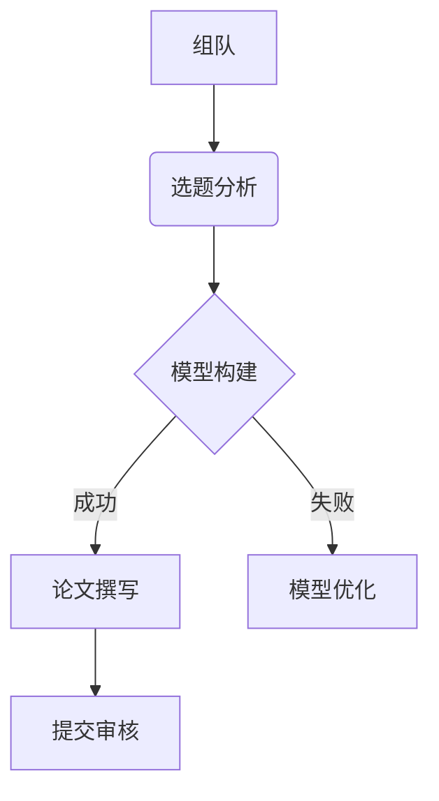

# 中南民族大学数学建模协会
> 官方代码仓库 | 2004年创立 | 国家级竞赛获奖团队

## 📌 协会简介

中南民族大学数学建模协会成立于2004年，是学术科技类校级社团。协会致力于：
- 培养数学建模思维与实战能力
- 组织参加国内外数学建模竞赛（国赛/美赛/华中杯等）
- 提供软件培训、论文写作指导、赛题解析等资源

🏆 **2023-2024荣誉**：
- 美国大学生数学建模竞赛H奖4项
- 全国大学生数学建模竞赛省级一等奖
- 全国统计建模大赛省级一等奖3项

## 🛠️ 资源目录


## 🚀 快速开始

### 新成员入门
1. 安装必备软件：
   ```bash
   # Python科学计算包
   pip install numpy scipy pandas matplotlib scikit-learn
   ```
2. 学习基础教程：
   - [数学建模入门讲义](Tutorials/Basic_Modeling/)
   - [论文写作规范](Documents/Paper_Writing_Spec.pdf)

### 竞赛准备流程


## 👥 团队协作

推荐团队结构：
| 角色 | 技能要求 | 职责 |
|------|----------|------|
| 建模手 | 数学推导/模型设计 | 问题分析、模型建立 |
| 程序员 | Python/MATLAB/R | 算法实现、数据处理 |
| 写作者 | LaTeX/Word | 论文撰写、可视化 |

## 📅 年度赛事日历
| 赛事名称 | 时间 | 级别 |
|----------|------|------|
| 华中杯 | 4月 | 省级B |
| 国赛 | 9月 | 国家级B |
| 美赛 | 2月 | 国家级C |

## 📚 学习资源
- [数学建模知识库](http://www.shumo.com/wiki/)
- [国赛官网](http://www.mcm.edu.cn/)
- [LaTeX公式编辑器](https://www.latexlive.com/)

## 📬 联系我们
- 协会办公室：大学生活动中心二楼
- 指导老师：罗敬教授 `stajluo@scuec.edu.cn`
- GitHub维护组：`MathModellers@outlook.com`
